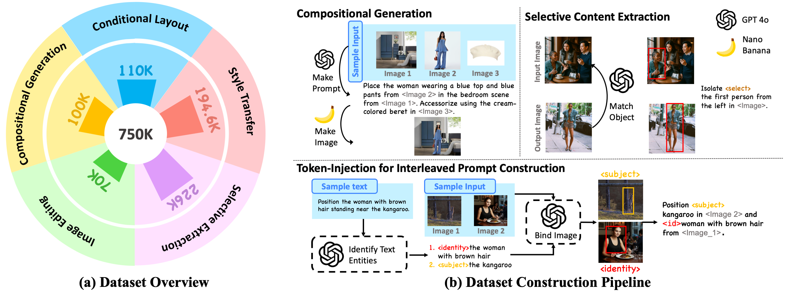

# SIGMA: Selective-Interleaved Generation with Multi-Attribute Tokens

<p align="center">
    <a href="https://arxiv.org/pdf/2602.07564">
            
    </a>
    <a href="https://github.com/auihund/SIGMA/">
        
    </a>
    <a href="https://huggingface.co/datasets/Xiaoyan667/SIGMA-Benchmark">
        
    </a>
    <a href="https://huggingface.co/Xiaoyan667/SIGMA-Model">
        
    </a>    
    <a href="https://huggingface.co/datasets/Xiaoyan667/SIGMA-dataset">
        
    </a>
</p>

SIGMA is a post-training framework for diffusion transformers that enables interleaved multi-condition image generation. Built on the unified Bagel backbone, SIGMA represents different visual conditions, such as style, content, subject, and identity, using selective multi-attribute tokens, allowing the model to interpret and compose multiple references within a single interleaved text–image sequence. By binding multiple condition images and textual descriptions into a unified sequence, SIGMA supports fine-grained, attribute-specific control during generation. Different attributes can be selectively extracted from the same reference image depending on the token type, enabling compositional editing, selective attribute transfer, and coherent multi-reference synthesis.

SIGMA is post-trained on 700K interleaved examples, significantly improving controllability, cross-condition consistency, and visual quality across diverse generation tasks. This repository provides the official implementation of SIGMA and its training pipeline.


## 🔧 Installation

```bash
git clone https://github.com/auihund/SIGMA
cd sigma
```


Set up environment
```bash
conda create -n sigma python=3.10 -y
conda activate sigma
pip install -r requirements.txt
pip install flash_attn==2.5.8 --no-build-isolation
```

## 📦 Model Weights

SIGMA is built on the Bagel unified backbone.

### 1️⃣ Bagel Backbone

SIGMA is post-trained on top of the Bagel unified backbone.

Please follow the official Bagel repository to download the base model weights:


```python
from huggingface_hub import snapshot_download

save_dir = "models/BAGEL-7B-MoT"
repo_id = "ByteDance-Seed/BAGEL-7B-MoT"
cache_dir = save_dir + "/cache"

snapshot_download(
    repo_id=repo_id,
    cache_dir=cache_dir,
    local_dir=save_dir,
    local_dir_use_symlinks=False,
    resume_download=True,
    allow_patterns=[
        "*.json", "*.safetensors", "*.bin", "*.py", "*.md", "*.txt"
    ],
)
```

### 2️⃣ SIGMA Post-trained Weights
You can download the SIGMA weights as follows:
```python
from huggingface_hub import snapshot_download

save_dir = "models/SIGMA"
repo_id = "Xiaoyan667/SIGMA"
cache_dir = save_dir + "/cache"

snapshot_download(
    repo_id=repo_id,
    cache_dir=cache_dir,
    local_dir=save_dir,
    local_dir_use_symlinks=False,
    resume_download=True,
)

```


After downloading, the directory structure should look like:

```text
models/
  ├── BAGEL-7B-MoT/                 # Bagel backbone  
  │   ├── config.json
  │   ├── model.safetensors
  │   ├── tokenizer.json
  │   └── ...
  │
  └── SIGMA/                        # SIGMA post-trained weights
      ├── model.safetensors         
      ├── ema.safetensors           
      ├── README.md
      └── data_status.pt           
```


## 📊 Dataset
### Overview

<p align="center"></p>

SIGMA is trained on a large-scale interleaved multi-condition dataset consisting of 700K samples, released as

👉 **HuggingFace Dataset:** Xiaoyan667/SIGMA-dataset

The corpus contains six task families:

- Compositional generation (100K)

- Selective content extraction (226K)

- Stylization (153K)

- Relation transfer (41.6K)

- Image editing (70K)

- Conditional layout generation (110K)

Compared to standard caption–image pairs, this interleaved formulation explicitly exposes multi-image and multi-attribute scenarios, which are central to controllable multimodal generation.


### Download
The dataset can be downloaded from HuggingFace and should be placed under the `dataset/` directory.

```python
from huggingface_hub import snapshot_download

save_dir = "dataset/SIGMA-dataset"
repo_id = "Xiaoyan667/SIGMA-dataset"

snapshot_download(
    repo_id=repo_id,
    local_dir=save_dir,
    local_dir_use_symlinks=False,
    resume_download=True,
)
```
After downloading, the directory structure will look like:
```text
data/
  └── SIGMA-dataset/
      ├── seedxedit_multi/
      ├── data_json/
      ├── parquet_info.json
      └── README.md
```


## 🔥 Training 
To start finetuning, run the provided script:
```bash
bash script/finetune.sh
```

## ⚡️ Inference
We provide two ways to run inference:
### 1) Batch Inference on Parquet
This mode runs inference over a Parquet dataset directory and saves generated results to `--output_dir`.

```bash
python inference_specialtoken.py \
  --parquet_dir parquet_dir \
  --start_id 0 \
  --model_path ./models/BAGEL-7B-MoT \
  --ema_model_path ./results/specialtoken/checkpoints/0050000 \
  --output_dir ./results/specialtoken/checkpoints/0050000/inference \
  --max_mem_per_gpu 50GiB \
  --use_lora False \
  --visual_gen True \
  --visual_und False
```

**Expected Paths**
- Bagel backbone: `./models/BAGEL-7B-MoT/`
- SIGMA checkpoint: `./results/.../checkpoints/<step>/` (or `./models/SIGMA/` if you download released weights)


### 2) Inference Demo
We also provide a notebook demo for interactive usage:
Open `demo.ipynb` with Jupyter:
```bash
jupyter notebook demo.ipynb
```


## Citation
If you find SIGMA useful in your research, please cite:
```bibtxt
@misc{zhang2026sigmaselectiveinterleavedgenerationmultiattribute,
      title={SIGMA: Selective-Interleaved Generation with Multi-Attribute Tokens}, 
      author={Xiaoyan Zhang and Zechen Bai and Haofan Wang and Yiren Song},
      year={2026},
      eprint={2602.07564},
      archivePrefix={arXiv},
      url={https://arxiv.org/abs/2602.07564}, 
}
```

